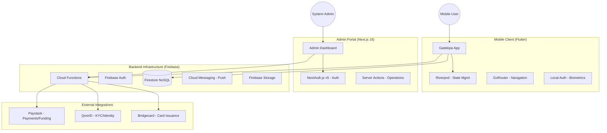

# Technical Architecture Document (TAD): Gatekeeper (Gatekipa) Platform

> **Status:** Production Stable (v1.0.8+18)  
> **Last Updated:** May 2026  
> **Core Principle:** "Zero Auto-Debit" Security Architecture

## 1. Executive Summary
The Gatekeeper (Gatekipa) platform is a high-assurance financial ecosystem designed to provide users with granular control over virtual card expenditures and recurring subscriptions. The platform consists of a **Flutter Mobile Application** and a **Next.js Admin Portal**, unified by a centralized **Firebase** backend and integrated with **Bridgecard** for virtual card issuance.

---

## 2. System Architecture

The ecosystem follows a **Mobile-First, Backend-as-a-Service (BaaS)** architecture with enterprise-grade administrative oversight.

### 2.1 Architecture Diagram

---

## 3. Technology Stack

### 3.1 Mobile Client (Flutter)
- **Framework**: Flutter 3.33+
- **State Management**: `flutter_riverpod` (v2.5) for decoupled, testable logic.
- **Navigation**: `go_router` (v14.3) for declarative routing.
- **Persistence**: `shared_preferences` & `flutter_secure_storage` for cryptographic keys.
- **UI/UX**: `flutter_animate`, `shimmer`, `google_fonts`, `fl_chart`.
- **Security**: `local_auth` for biometric-gated wallet transfers.

### 3.2 Admin Portal (Next.js)
- **Framework**: Next.js 16.2 (App Router)
- **Auth**: NextAuth.js v5 with Firebase Admin Session Cookies.
- **Styling**: Tailwind CSS 4.0.
- **Interactivity**: Framer Motion, Lucide React.
- **Logic**: Server-side validation via Firebase Admin SDK.

### 3.3 Backend & Infrastructure
- **Database**: Firestore (Document-based NoSQL).
- **Compute**: Firebase Cloud Functions (Node.js).
- **Identity**: Firebase Authentication with Custom Claims for RBAC.
- **Messaging**: FCM for real-time transaction alerts.

---

## 4. Key Architectural Pillars

### 4.1 "Zero Auto-Debit" Architecture
The system defaults to a "deny-by-default" stance for all recurring charges. 
- **Dynamic Freeze**: Virtual cards are initialized in a `frozen` state.
- **Rule-Based Validation**: Transactions are evaluated against `max_per_txn`, `monthly_cap`, and `block_if_amount_changes` rules.
- **Burner Mode**: Ability to create single-use cards (`max_charges: 1`).

### 4.2 Biometric-Gated Funding
To prevent unauthorized fund movement even if the device is unlocked:
- Moving funds from the **Main Wallet** to a **Virtual Card** requires a physical biometric signature.
- The `WalletProvider` intercepts transfer requests and triggers the `local_auth` prompt before committing the atomic Firestore transaction.

### 4.3 Subscription Detection Engine
- Uses a local **Machine Learning Parser** to analyze transaction patterns from linked bank statements or SMS alerts.
- Identifies merchants like Netflix, Spotify, and AWS to suggest rule-based card generation.

### 4.4 The Emergency Kill-Switch
A super-admin feature in the Admin Portal that executes a distributed payload:
1. Revokes all active user sessions.
2. Freezes every virtual card in the database.
3. Disables wallet deposit endpoints.

---

## 5. Data Models (Firestore)

### 5.1 `VirtualCardModel`
Stored in `cards` collection.
- `bridgecardCardId`: ID for partner API synchronization.
- `status`: `active`, `frozen`, `blocked`, `terminated`.
- `rules`: Array of `CardRule` (subTypes: `max_per_txn`, `night_lockdown`, etc.).

### 5.2 `WalletModel`
Stored in `accounts` collection.
- `balance`: Real-time fiat balance.
- `isLocked`: Security flag to halt all withdrawals.

---

## 6. Infrastructure Hardening
- **Environment Parity**: Uses a specialized private key parser for Vercel deployment to handle newline characters in service accounts.
- **Atomic Transactions**: Guarantees consistency between Wallet debits and Card credits.
- **Real-time Sync**: Mobile app listens to Firestore streams for sub-300ms UI updates upon administrative changes.

---

> **Document Owner:** Gatekeeper Engineering  
> **Contact:** dev-support@gatekipa.com
